#Clustering and PCA

We first begin with a clustering algorithm which will partition the
various types of wine into their mutually exclusive groupings. Centering
and scaling the data allows for easier interpretability down the line.
This is also done to represent a solid measure of distance. For example,
the fixed acidity feature has a variation that is larger by a factor of
80 from that of the citric acid feature. If we do not center and scale
the data, distance would be biased towards and driven more by the former
feature as opposed to the latter. Thus standardizing gives the features
equal weight. The choice of K is intuitive. Since there are two
‘classes’ of wine, we will implement 2 clusters in the algorithm. The
other K we will choose is 7 as there are 7 different levels of quality.

<table class="table" style="margin-left: auto; margin-right: auto;">
<caption>
Z-Score of Features for Color Cluster
</caption>
<thead>
<tr>
<th style="text-align:right;">
Fixed Acidity
</th>
<th style="text-align:right;">
Volatile Acidity
</th>
<th style="text-align:right;">
Citric Acid
</th>
<th style="text-align:right;">
Residual Sugar
</th>
<th style="text-align:right;">
Chlorides
</th>
<th style="text-align:right;">
Free Sulfur Dioxide
</th>
<th style="text-align:right;">
Total Sulfur Dioxide
</th>
<th style="text-align:right;">
Density
</th>
<th style="text-align:right;">
pH
</th>
<th style="text-align:right;">
Sulphates
</th>
<th style="text-align:right;">
Alcohol
</th>
</tr>
</thead>
<tbody>
<tr>
<td style="text-align:right;">
-0.2804833
</td>
<td style="text-align:right;">
-0.3953082
</td>
<td style="text-align:right;">
0.1143429
</td>
<td style="text-align:right;">
0.1998380
</td>
<td style="text-align:right;">
-0.3119753
</td>
<td style="text-align:right;">
0.2814861
</td>
<td style="text-align:right;">
0.4018607
</td>
<td style="text-align:right;">
-0.2306934
</td>
<td style="text-align:right;">
-0.1920315
</td>
<td style="text-align:right;">
-0.2853595
</td>
<td style="text-align:right;">
0.0256206
</td>
</tr>
<tr>
<td style="text-align:right;">
0.8286464
</td>
<td style="text-align:right;">
1.1678795
</td>
<td style="text-align:right;">
-0.3378091
</td>
<td style="text-align:right;">
-0.5903919
</td>
<td style="text-align:right;">
0.9216848
</td>
<td style="text-align:right;">
-0.8316090
</td>
<td style="text-align:right;">
-1.1872380
</td>
<td style="text-align:right;">
0.6815493
</td>
<td style="text-align:right;">
0.5673286
</td>
<td style="text-align:right;">
0.8430523
</td>
<td style="text-align:right;">
-0.0756924
</td>
</tr>
</tbody>
</table>
<table class="table" style="margin-left: auto; margin-right: auto;">
<caption>
Z-Score of Features for Quality Cluster
</caption>
<thead>
<tr>
<th style="text-align:right;">
Fixed Acidity
</th>
<th style="text-align:right;">
Volatile Acidity
</th>
<th style="text-align:right;">
Citric Acid
</th>
<th style="text-align:right;">
Residual Sugar
</th>
<th style="text-align:right;">
Chlorides
</th>
<th style="text-align:right;">
Free Sulfur Dioxide
</th>
<th style="text-align:right;">
Total Sulfur Dioxide
</th>
<th style="text-align:right;">
Density
</th>
<th style="text-align:right;">
pH
</th>
<th style="text-align:right;">
Sulphates
</th>
<th style="text-align:right;">
Alcohol
</th>
</tr>
</thead>
<tbody>
<tr>
<td style="text-align:right;">
-0.5274559
</td>
<td style="text-align:right;">
-0.2705650
</td>
<td style="text-align:right;">
-0.0235934
</td>
<td style="text-align:right;">
-0.4758752
</td>
<td style="text-align:right;">
-0.5841517
</td>
<td style="text-align:right;">
-0.1114941
</td>
<td style="text-align:right;">
-0.1563816
</td>
<td style="text-align:right;">
-1.3475581
</td>
<td style="text-align:right;">
-0.0501164
</td>
<td style="text-align:right;">
-0.3092743
</td>
<td style="text-align:right;">
1.4259406
</td>
</tr>
<tr>
<td style="text-align:right;">
-0.1724256
</td>
<td style="text-align:right;">
-0.3542499
</td>
<td style="text-align:right;">
0.3131731
</td>
<td style="text-align:right;">
1.4603783
</td>
<td style="text-align:right;">
-0.1499198
</td>
<td style="text-align:right;">
0.9439921
</td>
<td style="text-align:right;">
1.0018998
</td>
<td style="text-align:right;">
0.9185510
</td>
<td style="text-align:right;">
-0.5007093
</td>
<td style="text-align:right;">
-0.2771468
</td>
<td style="text-align:right;">
-0.8798985
</td>
</tr>
<tr>
<td style="text-align:right;">
0.0771945
</td>
<td style="text-align:right;">
1.6981704
</td>
<td style="text-align:right;">
-1.2835162
</td>
<td style="text-align:right;">
-0.6297275
</td>
<td style="text-align:right;">
0.6832362
</td>
<td style="text-align:right;">
-0.8002076
</td>
<td style="text-align:right;">
-1.1694085
</td>
<td style="text-align:right;">
0.4928536
</td>
<td style="text-align:right;">
0.9656231
</td>
<td style="text-align:right;">
0.3895175
</td>
<td style="text-align:right;">
-0.2497441
</td>
</tr>
<tr>
<td style="text-align:right;">
0.0931313
</td>
<td style="text-align:right;">
-0.4425734
</td>
<td style="text-align:right;">
0.2378545
</td>
<td style="text-align:right;">
-0.2627581
</td>
<td style="text-align:right;">
-0.2075565
</td>
<td style="text-align:right;">
-0.2703133
</td>
<td style="text-align:right;">
0.0797292
</td>
<td style="text-align:right;">
-0.4182059
</td>
<td style="text-align:right;">
-0.7231890
</td>
<td style="text-align:right;">
-0.5057277
</td>
<td style="text-align:right;">
-0.0919311
</td>
</tr>
<tr>
<td style="text-align:right;">
-0.6157180
</td>
<td style="text-align:right;">
-0.5335282
</td>
<td style="text-align:right;">
-0.1483901
</td>
<td style="text-align:right;">
-0.2915193
</td>
<td style="text-align:right;">
-0.2920409
</td>
<td style="text-align:right;">
0.4222010
</td>
<td style="text-align:right;">
0.5514027
</td>
<td style="text-align:right;">
-0.3304273
</td>
<td style="text-align:right;">
0.8147143
</td>
<td style="text-align:right;">
0.0892679
</td>
<td style="text-align:right;">
-0.1128693
</td>
</tr>
<tr>
<td style="text-align:right;">
2.0108356
</td>
<td style="text-align:right;">
0.4602869
</td>
<td style="text-align:right;">
0.9140114
</td>
<td style="text-align:right;">
-0.5632053
</td>
<td style="text-align:right;">
0.8372629
</td>
<td style="text-align:right;">
-0.8913594
</td>
<td style="text-align:right;">
-1.2734222
</td>
<td style="text-align:right;">
0.9680135
</td>
<td style="text-align:right;">
-0.0004092
</td>
<td style="text-align:right;">
1.3005945
</td>
<td style="text-align:right;">
0.1115354
</td>
</tr>
<tr>
<td style="text-align:right;">
0.7455152
</td>
<td style="text-align:right;">
1.0520924
</td>
<td style="text-align:right;">
1.2188753
</td>
<td style="text-align:right;">
-0.4670271
</td>
<td style="text-align:right;">
8.7931881
</td>
<td style="text-align:right;">
-0.6868957
</td>
<td style="text-align:right;">
-0.6924492
</td>
<td style="text-align:right;">
0.7568104
</td>
<td style="text-align:right;">
-0.8406609
</td>
<td style="text-align:right;">
3.4798534
</td>
<td style="text-align:right;">
-0.7832782
</td>
</tr>
</tbody>
</table>

    ## [1] 56135.28

    ## [1] 34018.28

    ## [1] 15320.72

    ## [1] 37437.72

As we can see above, these are the center points (or centroids) for both
cluster types across all 11 features used, z-scored. Thus, the
interpretation of theses numbers are as a z-score. That is, how many
standard deviations above the mean of the entire data set a cluster is
for a given feature. For example, the residual sugar amount for the
cluster by wine color is .1998 standard deviations above the mean of all
data points. Extending the interpretation, we can see that cluster one
has below average fixed acidity, volatile acidity, chlorides, density,
pH, and sulphates. Similar interpretations can be made for the quality
cluster (i.e. - the quality score by the wine snobs) and above average
features. When clustering for wine color, the within sum of squares and
between sum of squares are the same. However, when clustering for
quality, the K-Means++ algorithm returns a higher within sum of squares
and lower between sum of squares. Thus, we will use K-Means++ for both
the wine color and quality plots to determine the actual vs. predicted
groupings.We will visualize the various relationships of various
features and how well K-Means++ has clustered the labels.

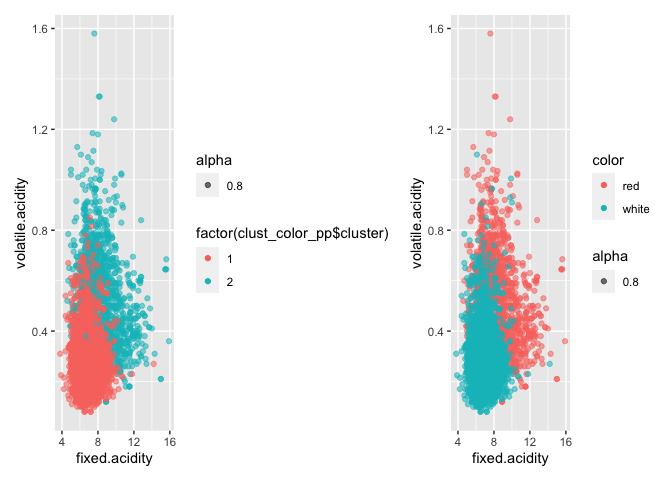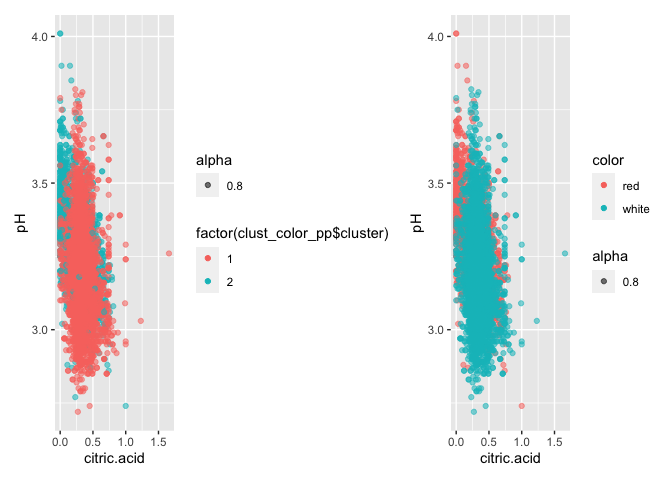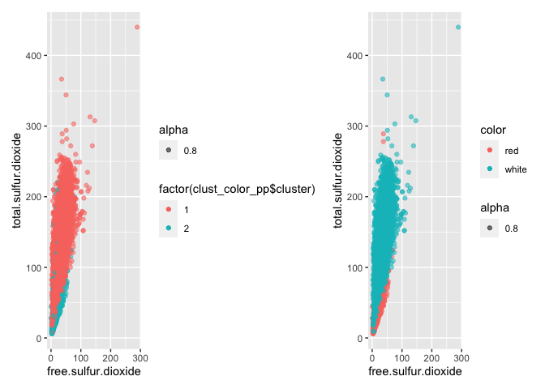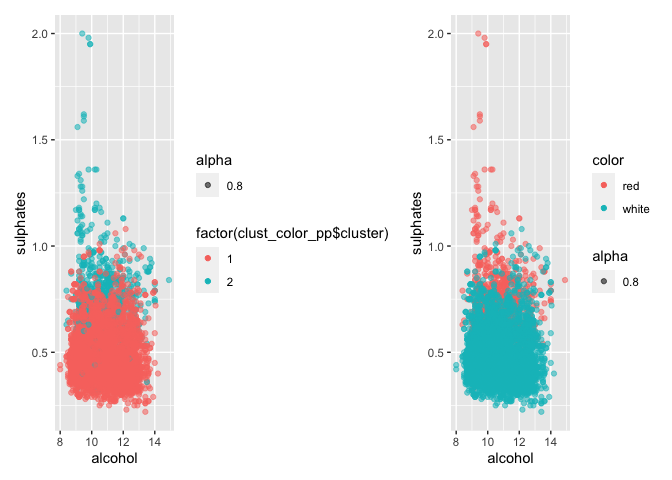

Above, we observe various feature relationships in two dimensions.
Unfortunately, observing all 11 features in 11 dimensions would be quite
ambiguous and tedious. We see here that the interpretation of K-Means++
clustering relative to the actual wine color groupings are rather on
par. The nice component of this analysis is the interpretability. There
seems to be a relatively clear distinction between red and white wines,
and the features represented here strongly indicate association

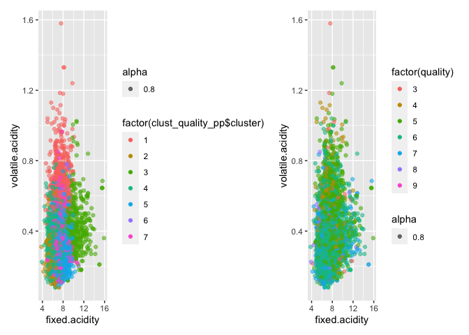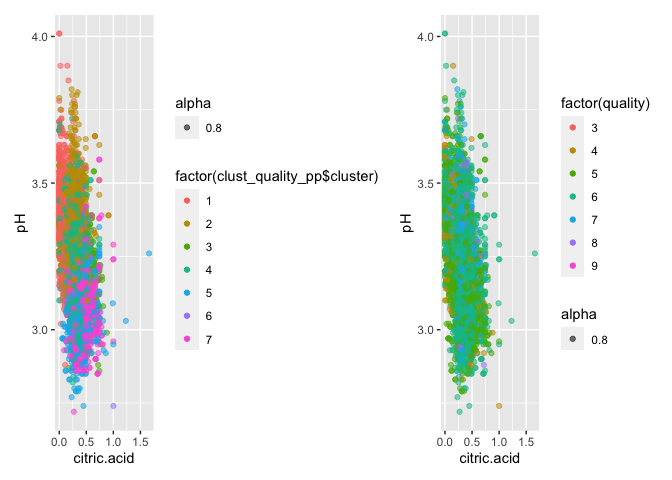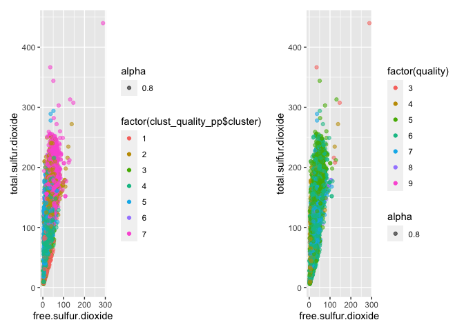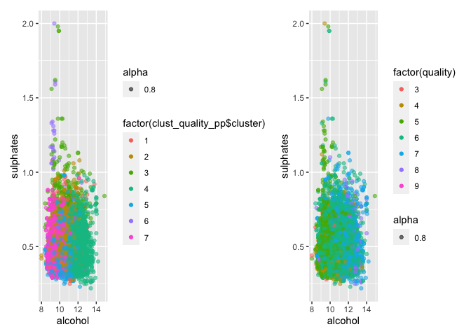

Observing the same relationships but for wine quality, we see the
interpretations are substantially more ambiguous and perhaps even
difficult to distinguish. Thus, wine quality is ambiguous. This makes
sense relative to how easily K-Means++ clustering grouped reds and
whites. A logical insinuation could be that color has a strong
association with the chemical process grapes undergo to evidently make
wine. Quality, however, was measured by wine tasting - a subjective
feature. Judges rating the quality of the wine certainly have personal
preferences. Thus, when attempting to cluster by quality level and
observing the various feature relationships, it is difficult to
distinguish what relationships among the features imply something about
the quality.

Next, we move onto a Principle Component Analysis (PCA) to determine if
this methodology allows for an easier interpretation of labels, and if
this emerges naturally from applying this technique.

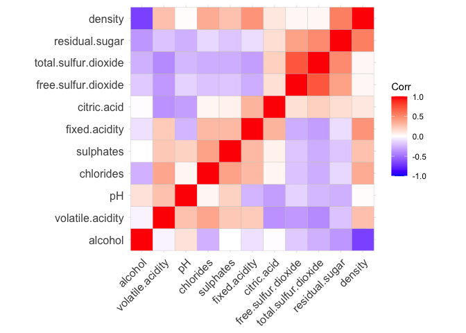

When observing correlations of features, we re-order the features
according to hierarchical clustering. In the top left and bottom right
regions of the hierarchical correlation plot, we can observe strong,
negative correlations. Unless you are a wine maker, a chemist, or a wine
connoisseur, perhaps these correlations do not make a lot of sense.
Let’s take an example of the negative correlation between alcohol level
and sulfur dioxide. A relatively straightforward example from this plot
could be the negative correlation between density and alcohol. Ethanol
is less dense than water, and the higher the concentration, the lower
the density. This is because the molecules of ethanol are not as densely
packed as, say, water. Chemical relationships are vast, so it is
important to disclaim that correlation may not imply causation in this
case. For this reason, it actually may not be best practice to
consolidate these chemical components of wine just because they appear
to be similar.

    ## Importance of first k=3 (out of 11) components:
    ##                           PC1    PC2    PC3
    ## Standard deviation     1.7407 1.5792 1.2475
    ## Proportion of Variance 0.2754 0.2267 0.1415
    ## Cumulative Proportion  0.2754 0.5021 0.6436

There are several takeaways from observing the summary of the analysis.
We see the standard deviation of the PCs is highest in PC1. The
proportion of variance each PC accounts for from the original data is
somewhat the same, but this proportion is highest in PC1.Cumulatively,
all three principle components account for a little more than two-thirds
of the variation from the original data.

<table>
<caption>
Principal Components
</caption>
<thead>
<tr>
<th style="text-align:left;">
</th>
<th style="text-align:right;">
PC1
</th>
<th style="text-align:right;">
PC2
</th>
<th style="text-align:right;">
PC3
</th>
</tr>
</thead>
<tbody>
<tr>
<td style="text-align:left;">
fixed.acidity
</td>
<td style="text-align:right;">
-0.24
</td>
<td style="text-align:right;">
0.34
</td>
<td style="text-align:right;">
-0.43
</td>
</tr>
<tr>
<td style="text-align:left;">
volatile.acidity
</td>
<td style="text-align:right;">
-0.38
</td>
<td style="text-align:right;">
0.12
</td>
<td style="text-align:right;">
0.31
</td>
</tr>
<tr>
<td style="text-align:left;">
citric.acid
</td>
<td style="text-align:right;">
0.15
</td>
<td style="text-align:right;">
0.18
</td>
<td style="text-align:right;">
-0.59
</td>
</tr>
<tr>
<td style="text-align:left;">
residual.sugar
</td>
<td style="text-align:right;">
0.35
</td>
<td style="text-align:right;">
0.33
</td>
<td style="text-align:right;">
0.16
</td>
</tr>
<tr>
<td style="text-align:left;">
chlorides
</td>
<td style="text-align:right;">
-0.29
</td>
<td style="text-align:right;">
0.32
</td>
<td style="text-align:right;">
0.02
</td>
</tr>
<tr>
<td style="text-align:left;">
free.sulfur.dioxide
</td>
<td style="text-align:right;">
0.43
</td>
<td style="text-align:right;">
0.07
</td>
<td style="text-align:right;">
0.13
</td>
</tr>
<tr>
<td style="text-align:left;">
total.sulfur.dioxide
</td>
<td style="text-align:right;">
0.49
</td>
<td style="text-align:right;">
0.09
</td>
<td style="text-align:right;">
0.11
</td>
</tr>
<tr>
<td style="text-align:left;">
density
</td>
<td style="text-align:right;">
-0.04
</td>
<td style="text-align:right;">
0.58
</td>
<td style="text-align:right;">
0.18
</td>
</tr>
<tr>
<td style="text-align:left;">
pH
</td>
<td style="text-align:right;">
-0.22
</td>
<td style="text-align:right;">
-0.16
</td>
<td style="text-align:right;">
0.46
</td>
</tr>
<tr>
<td style="text-align:left;">
sulphates
</td>
<td style="text-align:right;">
-0.29
</td>
<td style="text-align:right;">
0.19
</td>
<td style="text-align:right;">
-0.07
</td>
</tr>
<tr>
<td style="text-align:left;">
alcohol
</td>
<td style="text-align:right;">
-0.11
</td>
<td style="text-align:right;">
-0.47
</td>
<td style="text-align:right;">
-0.26
</td>
</tr>
</tbody>
</table>

Looking at the table, we notice similar loadings in PC1 as the
correlation plot. The higher, positive magnitudes associated with each
feature represents stronger positive correlations and higher, negative
magnitudes associated with each feature represents stronger, negative
correlations. PC2 may be a bit more ambiguous, in that all features but
pH and alcohol are positive. PC3 is similar but still different from
PC1.

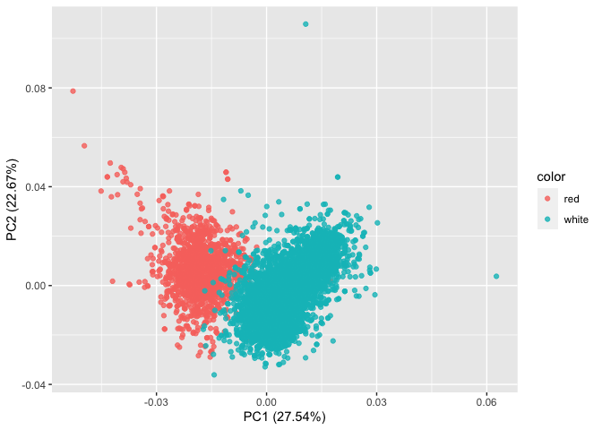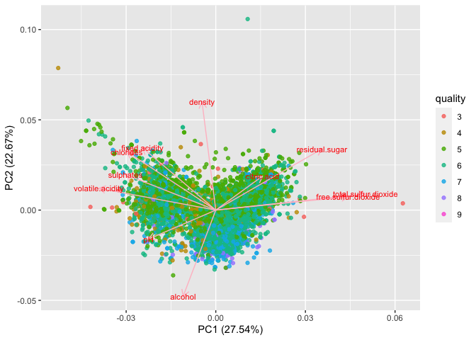

As the clustering methods showed, the color of the wine is easily
separated by principle components and they are easily distinguished. We
can also make the same conclusion about the quality level of wine
(i.e. - it is ambiguous). By consolidating the features for each data
point, the principle component does a great job at associating the
linear summaries for color of wine.

Both clustering and principle components analysis come to the same
conclusions more or less. However, K-Means++ offers slightly easier
interpretability since we are able to observe relationships while
holding clusters constant. The major difference between the clustering
methods and the PCA analyses are that the former consolidates by rows
(observations) depending on how you choose the number of clusters (k)
while the latter consolidates the columns (features). In doing so, there
are multiple things to say. Clustering is mutually exclusive meaning
each point is a member of only one cluster. A PCA, however, assumes that
a data point is some combination of many features which is linearly
summarized by projecting each data point and attempting to preserve
variation of the data. As alluded to before hand, this may simplify
something that may better be interpreted in its original form. Thus,
both methodologies yield similar conclusions. However,in this instance,
K-Means++ allows for a richer interpretation of the data in a multitude
of ways.

\#Market segmentation

I started with some pre-processing to do some manual feature compression
before my first approach of clustering. The original data had 36
categories of tweets, most of which had some kind of similarity or
overlap with other categories. I decided to make my own aggregate
columns in order to shrink the feature set by adding categories
together, then removing the originals. A few examples of these columns I
made were “healthy”: health/nutrition + personal fitness + sports
playing, “familyvalues”: parenting + family + religion, and “tweens”:
online_gaming + college/uni + school. I also dropped the “adult” and
“spam” columns as I felt these weren’t truly informative about market
segments. After this I had only 15 feature columns. I then plotted a
correlation matrix to see if there were any striking correlations
between my new categories:

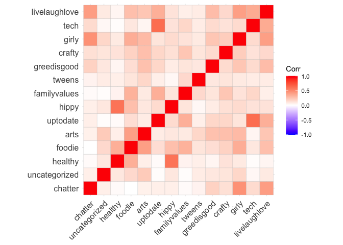

Some of the strongest correlations I saw were between the “healthy” and
“hippy” categories (0.6) and the “tech” and “uptodate” categories
(0.63). These make sense intuitively, so it looks like my categorical
compression worked.

Next we’ll scale and center our data, and use kmeans++ to create
clusters of market segments with similar tweets. Let’s start with 4
clusters:

    ##               clust1$center[1, ] * sigma + mu
    ## chatter                                   7.5
    ## uncategorized                             1.3
    ## healthy                                   4.0
    ## foodie                                    5.9
    ## arts                                      7.4
    ## uptodate                                  5.7
    ## hippy                                     1.3
    ## familyvalues                              2.9
    ## tweens                                    5.3
    ## greedisgood                               1.4
    ## crafty                                    1.6
    ## girly                                     6.2
    ## tech                                      1.5
    ## livelaughlove                             7.2

    ##               clust1$center[2, ] * sigma + mu
    ## chatter                                   3.5
    ## uncategorized                             0.6
    ## healthy                                   2.4
    ## foodie                                    1.8
    ## arts                                      2.2
    ## uptodate                                  4.1
    ## hippy                                     0.7
    ## familyvalues                              1.9
    ## tweens                                    2.7
    ## greedisgood                               0.5
    ## crafty                                    0.7
    ## girly                                     1.6
    ## tech                                      0.9
    ## livelaughlove                             2.9

    ##               clust1$center[3, ] * sigma + mu
    ## chatter                                   4.3
    ## uncategorized                             0.7
    ## healthy                                   3.5
    ## foodie                                    4.4
    ## arts                                      3.1
    ## uptodate                                 15.7
    ## hippy                                     1.5
    ## familyvalues                              7.1
    ## tweens                                    4.7
    ## greedisgood                               1.0
    ## crafty                                    1.4
    ## girly                                     2.9
    ## tech                                      4.2
    ## livelaughlove                             6.4

    ##               clust1$center[4, ] * sigma + mu
    ## chatter                                   3.9
    ## uncategorized                             1.0
    ## healthy                                  19.7
    ## foodie                                    6.2
    ## arts                                      3.4
    ## uptodate                                  5.2
    ## hippy                                     4.0
    ## familyvalues                              2.9
    ## tweens                                    3.2
    ## greedisgood                               0.7
    ## crafty                                    1.3
    ## girly                                     2.8
    ## tech                                      1.2
    ## livelaughlove                             3.9

After some experimentation with number of clusters, I settled on 4
clusters, which provided me with somewhat explainable insights about
market segments. Above is the un-Z-scored average tweet profile for each
cluster. We can look at these to glean some kind of information about
the interests of our customer base:

Cluster 1 has the highest average tweets in “chatter,” “arts,” and
“girly.” These could be described as the cluster of users whose Twitters
are fairly light-hearted, and they spend time talking to friends,
reposting their thoughts on arts and culture, and discussing beauty and
dating. Cluster 2 has very a very flat tweet profile, so these could be
people who are interested in all topics, and dabble in all areas of the
Twitterverse. Cluster 3 has a very significantly high loading on
“uptodate,” which includes politics, sports, and news. These could be
described as people who are very active in following the news and
current events, and who get lots of their media from Twitter. They might
be more socially aware than the average user. Cluster 4 has an extremely
high loading on “healthy,” which includes nutrition, athletics, health,
and fitness. These are your very fitness-minded people who are concerned
about artificial sweeteners and microplastics, and who NutrientH2O might
want to keep in the forefront of their mind when developing their
marketing.

While these “market segment” summaries are useful, we don’t have very
complete information on who these people are and we can only make an
educated guess on how to market to them most effectively. However, we
can tell that health and social awareness are important to NutrientH20’s
customer base.

\#Association rules for grocery purchases

    ## To reduce overplotting, jitter is added! Use jitter = 0 to prevent jitter.

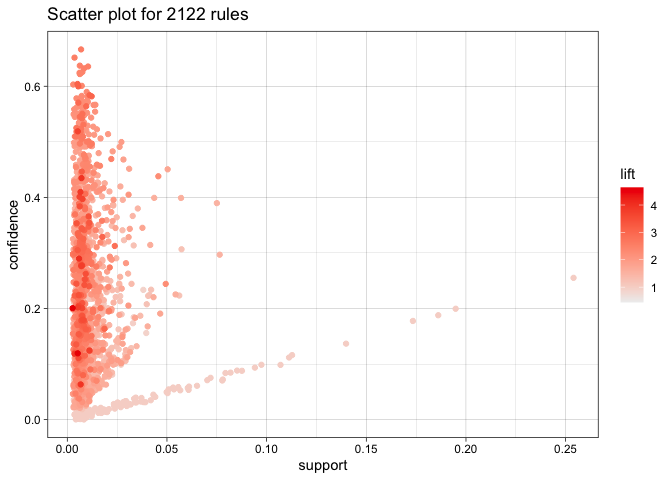

I set the parameters for original association rules of support and
confidence at 0.05. I did this to include most relations but no
insignificant ones with almost no support in the dataset or low
confidence in future predictions. As well, I wanted to keep the lengths
of association at three because most baskets were either four items or
less in the dataset.

    ##      lhs                        rhs                     support    confidence
    ## [1]  {}                      => {bottled water}         0.11052364 0.1105236 
    ## [2]  {}                      => {tropical fruit}        0.10493137 0.1049314 
    ## [3]  {}                      => {root vegetables}       0.10899847 0.1089985 
    ## [4]  {}                      => {soda}                  0.17437722 0.1743772 
    ## [5]  {}                      => {yogurt}                0.13950178 0.1395018 
    ## [6]  {}                      => {rolls/buns}            0.18393493 0.1839349 
    ## [7]  {}                      => {other vegetables}      0.19349263 0.1934926 
    ## [8]  {}                      => {whole milk}            0.25551601 0.2555160 
    ## [9]  {curd}                  => {whole milk}            0.02613116 0.4904580 
    ## [10] {whole milk}            => {curd}                  0.02613116 0.1022682 
    ## [11] {brown bread}           => {whole milk}            0.02521607 0.3887147 
    ## [12] {butter}                => {whole milk}            0.02755465 0.4972477 
    ## [13] {whole milk}            => {butter}                0.02755465 0.1078392 
    ## [14] {newspapers}            => {whole milk}            0.02735130 0.3426752 
    ## [15] {whole milk}            => {newspapers}            0.02735130 0.1070434 
    ## [16] {domestic eggs}         => {whole milk}            0.02999492 0.4727564 
    ## [17] {whole milk}            => {domestic eggs}         0.02999492 0.1173896 
    ## [18] {fruit/vegetable juice} => {whole milk}            0.02663955 0.3684951 
    ## [19] {whole milk}            => {fruit/vegetable juice} 0.02663955 0.1042579 
    ## [20] {whipped/sour cream}    => {other vegetables}      0.02887646 0.4028369 
    ## [21] {other vegetables}      => {whipped/sour cream}    0.02887646 0.1492380 
    ## [22] {whipped/sour cream}    => {whole milk}            0.03223183 0.4496454 
    ## [23] {whole milk}            => {whipped/sour cream}    0.03223183 0.1261441 
    ## [24] {pip fruit}             => {other vegetables}      0.02613116 0.3454301 
    ## [25] {other vegetables}      => {pip fruit}             0.02613116 0.1350499 
    ## [26] {pip fruit}             => {whole milk}            0.03009659 0.3978495 
    ## [27] {whole milk}            => {pip fruit}             0.03009659 0.1177875 
    ## [28] {pastry}                => {whole milk}            0.03324860 0.3737143 
    ## [29] {whole milk}            => {pastry}                0.03324860 0.1301234 
    ## [30] {citrus fruit}          => {other vegetables}      0.02887646 0.3488943 
    ## [31] {other vegetables}      => {citrus fruit}          0.02887646 0.1492380 
    ## [32] {citrus fruit}          => {whole milk}            0.03050330 0.3685504 
    ## [33] {whole milk}            => {citrus fruit}          0.03050330 0.1193792 
    ## [34] {sausage}               => {rolls/buns}            0.03060498 0.3257576 
    ## [35] {rolls/buns}            => {sausage}               0.03060498 0.1663903 
    ## [36] {sausage}               => {other vegetables}      0.02694459 0.2867965 
    ## [37] {other vegetables}      => {sausage}               0.02694459 0.1392538 
    ## [38] {sausage}               => {whole milk}            0.02989324 0.3181818 
    ## [39] {whole milk}            => {sausage}               0.02989324 0.1169916 
    ## [40] {bottled water}         => {soda}                  0.02897814 0.2621895 
    ## [41] {soda}                  => {bottled water}         0.02897814 0.1661808 
    ## [42] {bottled water}         => {whole milk}            0.03436706 0.3109476 
    ## [43] {whole milk}            => {bottled water}         0.03436706 0.1345006 
    ## [44] {tropical fruit}        => {yogurt}                0.02928317 0.2790698 
    ## [45] {yogurt}                => {tropical fruit}        0.02928317 0.2099125 
    ## [46] {tropical fruit}        => {other vegetables}      0.03589222 0.3420543 
    ## [47] {other vegetables}      => {tropical fruit}        0.03589222 0.1854966 
    ## [48] {tropical fruit}        => {whole milk}            0.04229792 0.4031008 
    ## [49] {whole milk}            => {tropical fruit}        0.04229792 0.1655392 
    ## [50] {root vegetables}       => {yogurt}                0.02582613 0.2369403 
    ## [51] {yogurt}                => {root vegetables}       0.02582613 0.1851312 
    ## [52] {root vegetables}       => {other vegetables}      0.04738180 0.4347015 
    ## [53] {other vegetables}      => {root vegetables}       0.04738180 0.2448765 
    ## [54] {root vegetables}       => {whole milk}            0.04890696 0.4486940 
    ## [55] {whole milk}            => {root vegetables}       0.04890696 0.1914047 
    ## [56] {soda}                  => {yogurt}                0.02735130 0.1568513 
    ## [57] {yogurt}                => {soda}                  0.02735130 0.1960641 
    ## [58] {soda}                  => {rolls/buns}            0.03833249 0.2198251 
    ## [59] {rolls/buns}            => {soda}                  0.03833249 0.2084024 
    ## [60] {soda}                  => {other vegetables}      0.03274021 0.1877551 
    ## [61] {other vegetables}      => {soda}                  0.03274021 0.1692065 
    ## [62] {soda}                  => {whole milk}            0.04006101 0.2297376 
    ## [63] {whole milk}            => {soda}                  0.04006101 0.1567847 
    ## [64] {yogurt}                => {rolls/buns}            0.03436706 0.2463557 
    ## [65] {rolls/buns}            => {yogurt}                0.03436706 0.1868436 
    ## [66] {yogurt}                => {other vegetables}      0.04341637 0.3112245 
    ## [67] {other vegetables}      => {yogurt}                0.04341637 0.2243826 
    ## [68] {yogurt}                => {whole milk}            0.05602440 0.4016035 
    ## [69] {whole milk}            => {yogurt}                0.05602440 0.2192598 
    ## [70] {rolls/buns}            => {other vegetables}      0.04260295 0.2316197 
    ## [71] {other vegetables}      => {rolls/buns}            0.04260295 0.2201787 
    ## [72] {rolls/buns}            => {whole milk}            0.05663447 0.3079049 
    ## [73] {whole milk}            => {rolls/buns}            0.05663447 0.2216474 
    ## [74] {other vegetables}      => {whole milk}            0.07483477 0.3867578 
    ## [75] {whole milk}            => {other vegetables}      0.07483477 0.2928770 
    ##      coverage   lift      count
    ## [1]  1.00000000 1.0000000 1087 
    ## [2]  1.00000000 1.0000000 1032 
    ## [3]  1.00000000 1.0000000 1072 
    ## [4]  1.00000000 1.0000000 1715 
    ## [5]  1.00000000 1.0000000 1372 
    ## [6]  1.00000000 1.0000000 1809 
    ## [7]  1.00000000 1.0000000 1903 
    ## [8]  1.00000000 1.0000000 2513 
    ## [9]  0.05327911 1.9194805  257 
    ## [10] 0.25551601 1.9194805  257 
    ## [11] 0.06487036 1.5212930  248 
    ## [12] 0.05541434 1.9460530  271 
    ## [13] 0.25551601 1.9460530  271 
    ## [14] 0.07981698 1.3411103  269 
    ## [15] 0.25551601 1.3411103  269 
    ## [16] 0.06344687 1.8502027  295 
    ## [17] 0.25551601 1.8502027  295 
    ## [18] 0.07229283 1.4421604  262 
    ## [19] 0.25551601 1.4421604  262 
    ## [20] 0.07168277 2.0819237  284 
    ## [21] 0.19349263 2.0819237  284 
    ## [22] 0.07168277 1.7597542  317 
    ## [23] 0.25551601 1.7597542  317 
    ## [24] 0.07564820 1.7852365  257 
    ## [25] 0.19349263 1.7852365  257 
    ## [26] 0.07564820 1.5570432  296 
    ## [27] 0.25551601 1.5570432  296 
    ## [28] 0.08896797 1.4625865  327 
    ## [29] 0.25551601 1.4625865  327 
    ## [30] 0.08276563 1.8031403  284 
    ## [31] 0.19349263 1.8031403  284 
    ## [32] 0.08276563 1.4423768  300 
    ## [33] 0.25551601 1.4423768  300 
    ## [34] 0.09395018 1.7710480  301 
    ## [35] 0.18393493 1.7710480  301 
    ## [36] 0.09395018 1.4822091  265 
    ## [37] 0.19349263 1.4822091  265 
    ## [38] 0.09395018 1.2452520  294 
    ## [39] 0.25551601 1.2452520  294 
    ## [40] 0.11052364 1.5035766  285 
    ## [41] 0.17437722 1.5035766  285 
    ## [42] 0.11052364 1.2169396  338 
    ## [43] 0.25551601 1.2169396  338 
    ## [44] 0.10493137 2.0004746  288 
    ## [45] 0.13950178 2.0004746  288 
    ## [46] 0.10493137 1.7677896  353 
    ## [47] 0.19349263 1.7677896  353 
    ## [48] 0.10493137 1.5775950  416 
    ## [49] 0.25551601 1.5775950  416 
    ## [50] 0.10899847 1.6984751  254 
    ## [51] 0.13950178 1.6984751  254 
    ## [52] 0.10899847 2.2466049  466 
    ## [53] 0.19349263 2.2466049  466 
    ## [54] 0.10899847 1.7560310  481 
    ## [55] 0.25551601 1.7560310  481 
    ## [56] 0.17437722 1.1243678  269 
    ## [57] 0.13950178 1.1243678  269 
    ## [58] 0.17437722 1.1951242  377 
    ## [59] 0.18393493 1.1951242  377 
    ## [60] 0.17437722 0.9703476  322 
    ## [61] 0.19349263 0.9703476  322 
    ## [62] 0.17437722 0.8991124  394 
    ## [63] 0.25551601 0.8991124  394 
    ## [64] 0.13950178 1.3393633  338 
    ## [65] 0.18393493 1.3393633  338 
    ## [66] 0.13950178 1.6084566  427 
    ## [67] 0.19349263 1.6084566  427 
    ## [68] 0.13950178 1.5717351  551 
    ## [69] 0.25551601 1.5717351  551 
    ## [70] 0.18393493 1.1970465  419 
    ## [71] 0.19349263 1.1970465  419 
    ## [72] 0.18393493 1.2050318  557 
    ## [73] 0.25551601 1.2050318  557 
    ## [74] 0.19349263 1.5136341  736 
    ## [75] 0.25551601 1.5136341  736

    ## To reduce overplotting, jitter is added! Use jitter = 0 to prevent jitter.

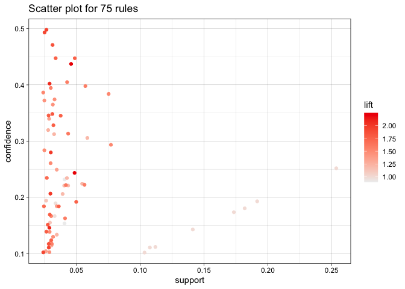

When setting the subset for this graph I wanted to see which
relationships occurred more often than the base level of support. Also I
greatly enhanced the level of confidence in the interaction because I
wanted to see which interactions would have a large lift. Some of the
interactions were to be expected like “butter” and “milk” or “root
vegetables” and “other vegetables”. These likely occur because they are
held in the same sections, meaning that a customer will look at both
objects in relatively short succession and more than likely take both
with them if they are picking one. Another sensical relationship in with
a large lift is “sausage” and “rolls/buns”, there was a relatively large
lift of 1.77. This basically proves the age old economics idea of
complementary goods. Many times in economics lectures, professors always
use hot dogs and buns as complementary goods. Now we see this proven in
a real context, when buying sausage a consumer tends to buy buns.
